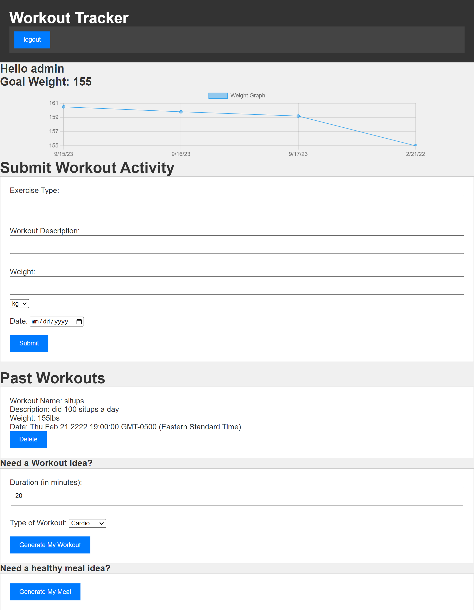

# G3 Fitness Tracker


https://g3fitness-tracker-54a2e145f48e.herokuapp.com/login

G3 Fitness Tracker is a web application designed to help users track their fitness progress, log workouts, and receive personalized workout and meal suggestions powered by AI. This README provides an overview of the project, how to set it up, and key features.

## Table of Contents

- [Features](#features)
- [Built With](#built-with)
- [Installation](#installation)
- [Usage](#usage)
- [Contributing](#contributing)
- [License](#license)
- [Acknowledgments](#acknowledgments)

## Features

- **User-Specific Data:** Users can input their name and goal weight.
- **Weight Tracking Graph:** Visualize your weight changes over time.
- **Workout Logging:** Log workout details, including exercise type, description, weight, and date.
- **Workout History:** View and manage a history of past workouts.
- **AI-Powered Suggestions:** Get personalized workout and meal suggestions powered by AI.

## Built With

- [Node.js](https://nodejs.org/)
- [Express.js](https://expressjs.com/)
- [MySQL](https://www.mysql.com/)
- [Sequelize](https://sequelize.org/)
- [Handlebars](https://handlebarsjs.com/)
- [Chart.js](https://www.chartjs.org/)
- [OpenAI API](https://beta.openai.com/)

## Installation

Follow these steps to set up the G3 Fitness Tracker project on your local machine:

1. **Clone the Repository:**

    - git clone <repository-url>

2. **Install Dependencies:**

    - npm install

3. **Database Setup:**

    - Create a MySQL database.

4. **Environment Variables:**

    - Create a .env file and configure the following environment variables:

    ```DB_NAME=your_database_name
    DB_USER=your_database_user
    DB_PASSWORD=your_database_password
    OPENAI_API_KEY=your_key

4. **Start the Application:**

   ```bash
   npm start

5. **Access the Application:**

Open a web browser and navigate to http://localhost:3001.

## Usage

**User Dashboard:**

- Upon login, you'll see your user-specific information, including your name and goal weight.
A weight tracking graph displays your weight changes over time.
**Submit Workout:**

- In the "Submit Workout Activity" section, enter exercise details, including exercise type, description, weight, and date.
Click "Submit" to log the workout.
**Past Workouts:**

- View a history of past workouts in the "Past Workouts" section.
Each workout entry displays details such as exercise name, description, weight, and date.
Delete workouts by clicking the "Delete" button.
**Generate Workout Ideas:**

- Need workout inspiration? In the "Need a Workout Idea?" section, specify the duration and type of workout.
Click "Generate My Workout" to receive personalized workout suggestions.
**Generate Meal Ideas:**

- Craving a healthy meal? In the "Need a healthy meal idea?" section, click "Generate My Meal" to receive personalized meal suggestions powered by AI.

### Authors

This project was developed by:

- Nick
- Kenneth
- Adrian

## Contributing

Contributions to the G3 Fitness Tracker project are welcome! Here's how you can contribute:

- Report issues: If you encounter any bugs or have suggestions for improvements, please [open an issue](<https://github.com/NickUCLA/G3-Fitness-Tracker>/issues).

- Contribute code: Feel free to fork the repository, make changes, and submit a pull request.

## License

This project is licensed under the MIT License.

## Acknowledgments

The G3 Fitness Tracker project uses Chart.js for data visualization. AI-powered suggestions are provided using machine learning and natural language processing techniques.
